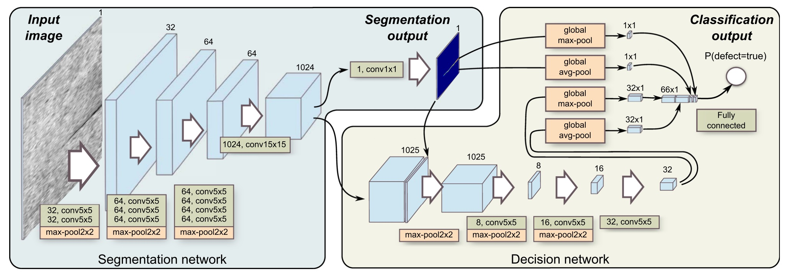

# Segmentation-Based Deep-Learning Approach for Surface-Defect Detection
## Try to make this as a productive project(on going)
## Implement this paper by Pytorch
[SDASDD](https://link.springer.com/article/10.1007/s10845-019-01476-x)

## Network Arch


## usage
### prepare your KolektorSDD dataset
    1. under KolktorSDD dir, create two txt files('train.txt','val.txt')
    2. write the image filename and label filename like below:
    ```
    kos01/Part5.jpg kos01/Part5_label.bmp
    kos02/Part6.jpg kos02/Part6_label.bmp
    kos03/Part2.jpg kos03/Part2_label.bmp
    kos04/Part3.jpg kos04/Part3_label.bmp
    ...
    ```
### start training
    1. modify 'train.py'
    DATAROOT
    GLOBALEPOCH
    INPUTHW
    2. python train.py
## TODO
- [x] Forward finished
- [x] Segmentation Net Training & Validate functions
- [ ] Decision Net Training & Validate functions
- [ ] resume training script
- [ ] Tensorboard record
- [ ] Model fuse
- [ ] ONNX format
- [ ] Windows deployment
- [ ] Linux deployment
